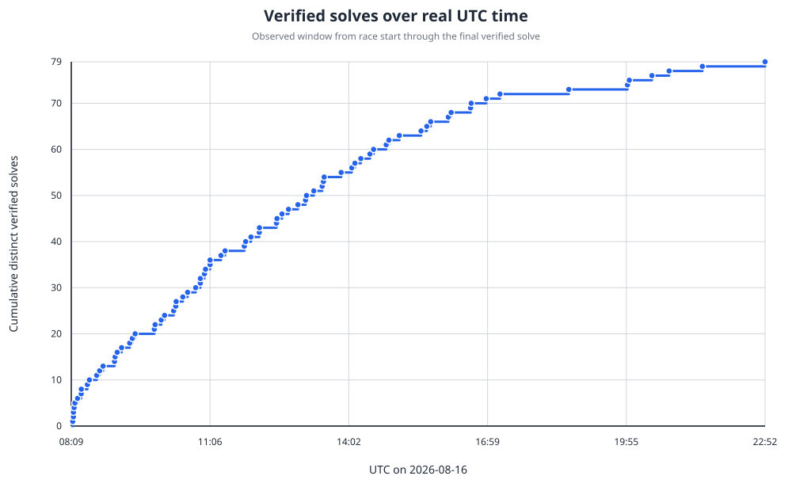
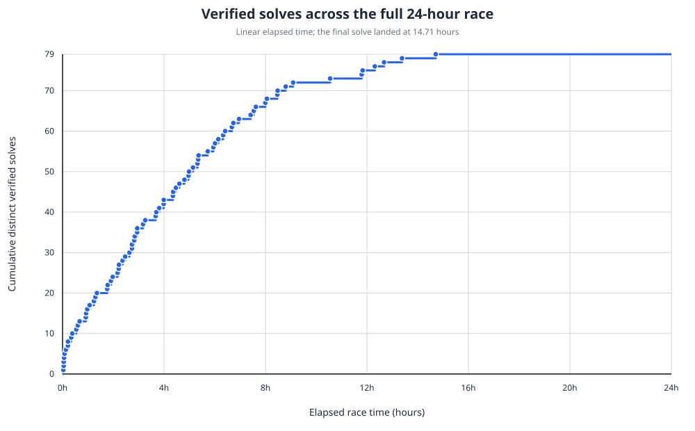
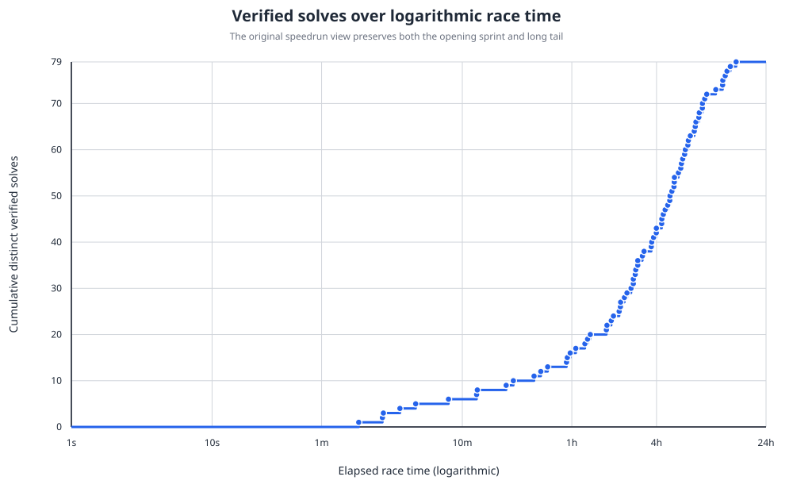
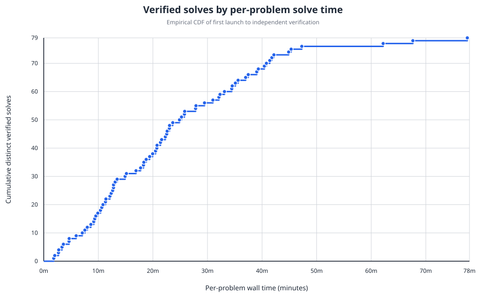
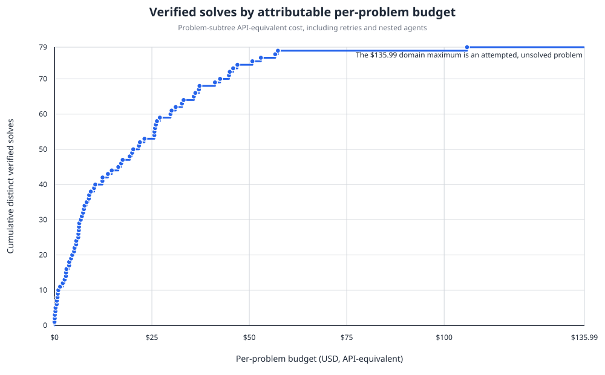
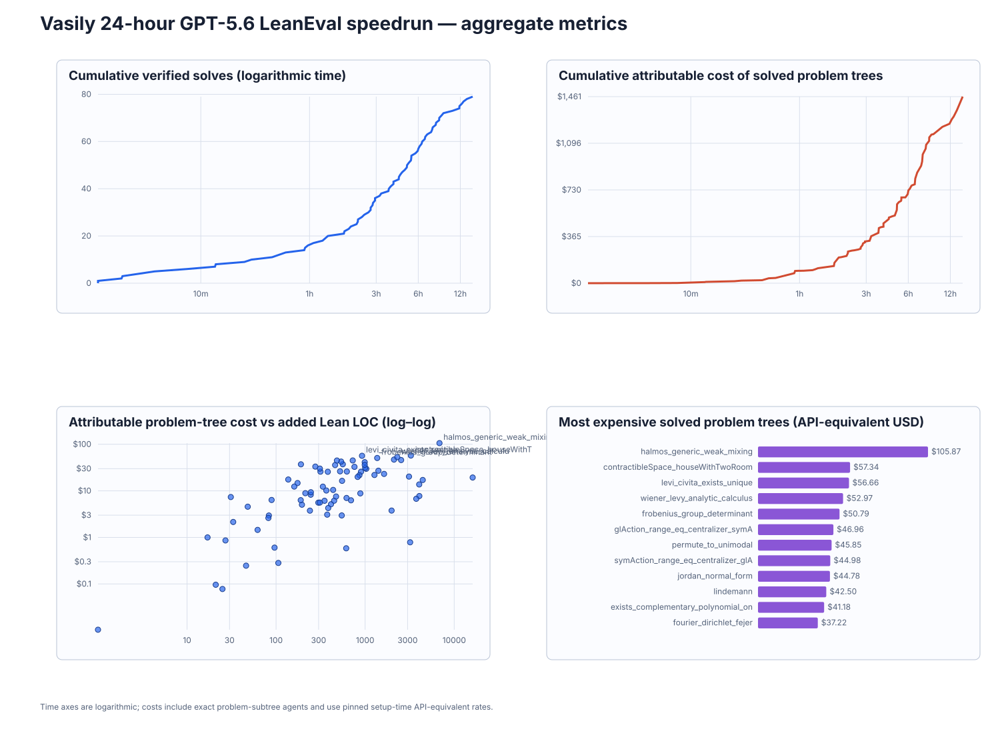

# Speedrun analysis

This directory contains every derived analysis artifact for the 24-hour run.
The canonical problem table is [`metrics.csv`](metrics.csv), its structured
form is [`metrics.json`](metrics.json), and the full accounting narrative is
[`metrics.md`](metrics.md). [`trace_index.csv`](trace_index.csv) maps all 421
archived rollout sessions to their parents and owning problem trees.

## Solves over real time

Linear UTC clock time from the race start through the final verified solve.



## Solves over the full 24 hours

Linear elapsed race time over the fixed 24-hour window, including the plateau
after the last solve at 14.71 hours.



## Solves over logarithmic race time

The original prompt requested a logarithmic time axis. This view preserves both
the opening seconds and the later multi-hour tail.



## Solves over solve time

This is the empirical cumulative distribution of per-problem wall latency from
first launch through independent verification. The axis runs through 78 minutes
to include every verified solve at its true value; the maximum observed latency
was 77.60 minutes.



## Solves over budget

This is the empirical cumulative distribution of attributable per-problem
subtree cost, including retries and nested agents. The axis ends at $135.99,
the rounded maximum among all attempted problems. That maximum belongs to the
unsolved `hopf_umlaufsatz`; verified solves plateau at the solved maximum of
$105.87.



## Aggregate dashboard

The dashboard combines cumulative cost, proof size versus cost, and the most
expensive verified problem trees.



## Reproduction

```bash
python3 scripts/aggregate_speedrun_metrics.py \
  --repo "$PWD" \
  --raw-root /data/codex/jobs/lean-eval-speedrun \
  --output analysis \
  --baseline 8cdf39e15cda5b001ad8e4416829e748b70bb2c2

python3 scripts/graph_speedrun.py
```

The graph renderer checks that the deterministic solve ledger and metrics table
contain the same 79 verified problems before writing any plots.
